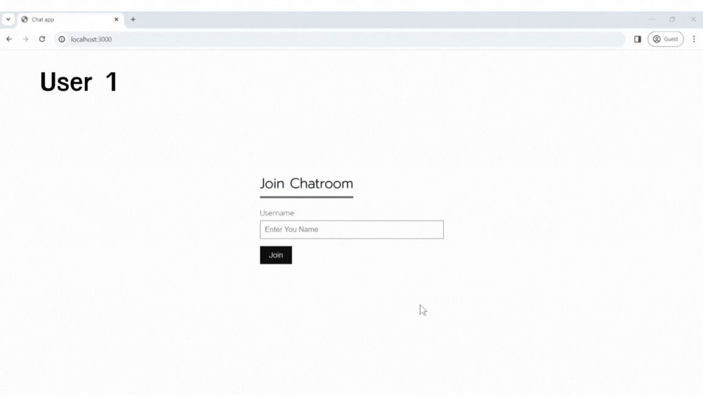
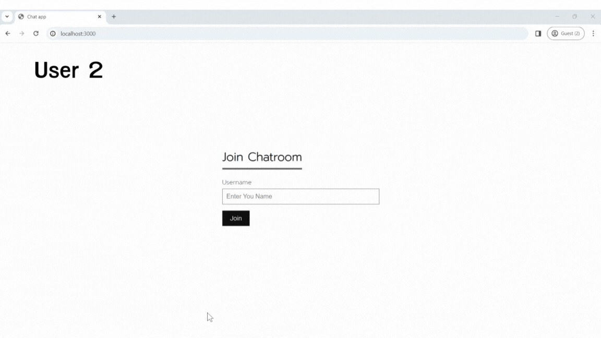
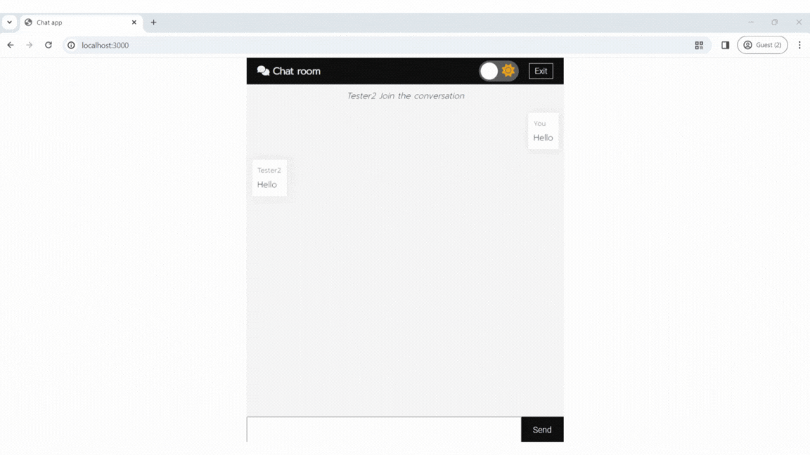
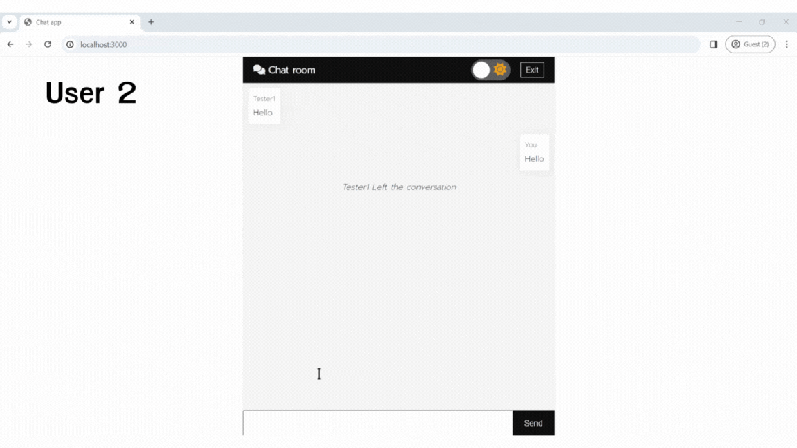

# Chat App

## Try Damo
**You can try out the website at this link : https://chat-app-iv5d.onrender.com/**

## About the website
This website is a learning project that demonstrates the use of Javascript in conjunction with socket.io. The website focuses on real-time communication between the server and client, allowing for real-time data transmission and reception.

## How to use and what you need
* The index.js file uses two main libraries:
   * **Express**: This library is used to start the server.
   * **Socket.io**: A library that enables real-time communication between the server and client.

* To use the website, you will need the following:
   * **Node.js**
   * **Node Package Manager (NPM)**

## Basic usage
1. After installing `Node.js`, open a terminal and install NPM with the command `npm i`.
2. Start the server with the command `node index.js`. If the server starts successfully, you will see the message "**Server running on port 3000**".
3. After starting the server, access the website at the URL: `http://localhost:3000/`.
4. To stop the server, press **`Ctrl+C`**.

## Introduction to the website
The website allows users to send messages to each other in real-time through a chat room. The chat room can accommodate multiple users (group chat).

## Website details
Join Chat Page : This is the first page that users see. It allows them to enter a username for chatting.

**User 1** Join Chat

**User 2** Join Chat

When **User 2** enters the chat room, **User 1's** screen will display a notification indicating that **User 2** has joined the chat room.

After joining the chat room, **User 1** can chat with **User 2**.

**User 2** can also see User 1's messages and can chat with User 1.

Both User 1 and User 2 can switch to dark mode.

To leave the chat room, users can click the exit button in the upper right corner. In this demo, User 1 leaves the chat room.

When User 1 leaves the chat room, User 2 will see a notification indicating that User 1 has left the chat room.

### Postscript
This project was developed solely for the purpose of practicing the use of the Socket.IO library. It does not have any other hidden intentions.I would like to express my sincere gratitude to everyone who has visited my Chat App project.If you have any feedback or suggestions, please feel free to share them with me.I am always open to learning and improving my work.Thank you.
